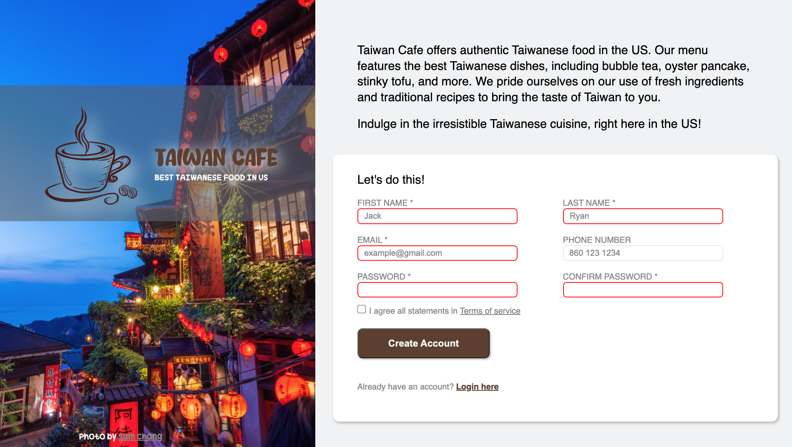

# Sign-Up-Form
This is a simple sign-up form created with HTML, CSS, and JavaScript. It allows users to input their name, email, and password to create a new account.

## Table of Contents
- Demo
- Technologies Used
- Features
- Credits
## Demo
Check out the [**live**](https://elsiechen.github.io/Sign-Up-Form/
) demo.

## Technologies Used
- HTML
- CSS
- JavaScript
## Features
- Achieve responsive web design by designing the website using flexible layouts and images, and by using media queries to adapt the layout based on the size of devices.
- Use CSS layout module Flexbox to create flexible and responsive layouts in web design
- Built-in form validation for inputs using regular expression
- Validate password match and report error message using JavaScript
- Clear input hints to improve user experience
- Styling form to show invalid inputs from valid ones to help user finish the form
- Use CSS custom property to set a few theme colors instead of having to update every single instance of a specific value
## Credits
- The Odin Project: [Sign-Up Form](https://www.theodinproject.com/lessons/node-path-intermediate-html-and-css-sign-up-form)
- Coffee logo by [pngtree](https://pngtree.com/element/down?id=NjAxOTc3MQ==&type=1&time=1679968959&token=NWQ2NTNjMmU3NTczOThhNjY0MDIwZmYzYzk0ZWRhOWI=&t=0)
- Custom fonts from [dafont.com](https://www.dafont.com/moms-typewriter.font?text=sweetsmile&back=theme)